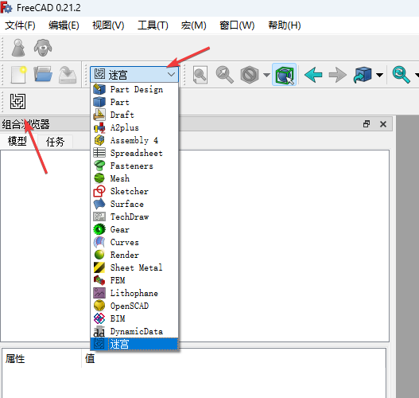
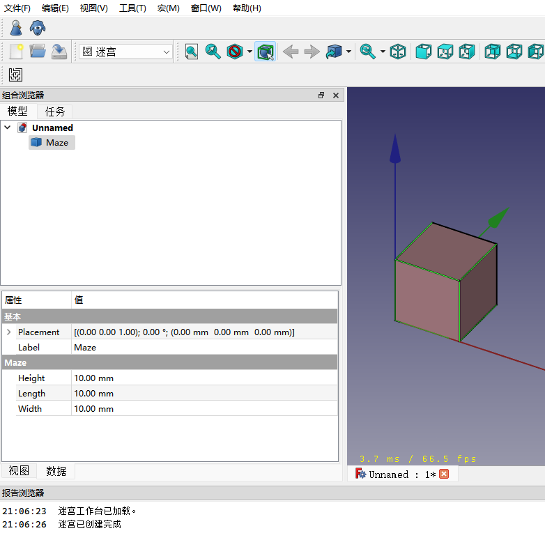

# FreeCAD 工作台（Workbench）开发笔记『二』

通过上一篇笔记的梳理，对工作台开发的整体概念和必要的文件已经有了大概的了解，接下来需要深入了解一下各个模块的具体作用及其使用方法。

## 本节学习目标
- 了解 `FreeCAD` 里的基本功能模块；
- 实现点击功能按钮，创建一个带有属性的基本三维对象；
- 调整属性，观察三维对象是否发生变化；
- 保存文档并重新打开，确认所有属性保存完整。

## 一、工作台可使用的主要模块

在 `FreeCAD` 里有很多模块，他们在 `工作台` 和 `宏脚本` 里都可以使用，最常使用的有两个：

- FreeCAD
  - `FreeCAD` 又可以简写为 `App` ，主要用来调用和操作与界面（UI）无关的功能，它有以下几种引用方式：
    ```python
    # 方式一
    from freecad import app

    # 方式二
    import FreeCAD as App
    ```
  - 常用的方法和属性
    - `app.ActiveDocument`: 获取当前活动的文档；
    - `app.newDocument()`: 创建一个新的文档；
    - `app.Console.PrintMessage()`: 在 `FreeCAD` 的报告浏览器中输出字符，如:
      ```python
      app.Console.PrintMessage("测试内容")
      ```
    - `app.ActiveDocument.recompute()`: 重新计算当前文档，即重新绘制三维对象。

- FreeCADGui
  - `FreeCADGui` 是用来调用和界面（UI）相关的功能，它有以下几种引用方式：
    ```python
    # 方式一
    from freecad import gui

    # 方式二
    import FreeCADGui as Gui
    ```
  - 常用的方法和属性
    - `gui.addCommand()`: 向 `FreeCAD` 注册一个命令，如：
      ```python
      gui.addCommand('createThing', createThing())
      ```
    - `gui.addWorkbench()`: 向 `FreeCAD` 注册一个工作台，如：
      ```python
      gui.addWorkbench(MazeWorkbench())
      ```
    - `gui.Selection.getSelection()`: 获取当前选中的对象，返回是一个数组

## 二、调用其他工作台的功能
- 有时候需要在代码中调用系统其他工作台里的功能，比如 `Part` 工作台里的功能，那就需要先将其导入，如：
  ```python
  import Part
  ```
- 导入后就可以正常使用了，如：
  ```python
  # 创建一个 10x10x10 的立方体
  Part.makeBox(10,10,10)
  ```

## 三、命令（按钮）基本定义
- 在上一次的笔记中使用过一个基本的命令（按钮）：
  ```python
  class CreateMaze():
    def GetResources(self):
        return {"Pixmap"  : APPICON,  
                "MenuText": "创建迷宫",
                "ToolTip" : "创建一个3D迷宫"}

    def Activated(self):
        app.Console.PrintMessage("迷宫已创建完成\n")
        return

    def IsActive(self):
        '''
        判断当前命令是否可用
        '''
        return True
  ```
  - `GetResources()`: 用于获取命令（按钮）的图标、名称、提示等基本属性，该方法 **必需** 定义；
  - `Activated()`: 用于命令被调用时执行的功能，该方法 **必需** 定义；
  - `IsActive()`: 判断当前命令是否可用，该方法可选，默认命令为可用；
- 一个命令通常为一个 `python` 的类，通过以上规则进行定义；
- 在一个工作台里通常会有多个命令，所以为了方便扩展，可以定义一个基类，如：
  ```python
  class BaseCommand(object):
    def GetResources(self):
        return {'Pixmap': self.Pixmap,
                'MenuText': self.MenuText,
                'ToolTip': self.ToolTip}

    def Activated(self):
        return

    def IsActive(self):
        if app.ActiveDocument is None:
            return False
        else:
            return True
  ```
- 然后其他命令通过这个基类来继承，如：
  ```python
  class CreateMazeA(BaseCommand):
    Pixmap = APPICON
    MenuText = "创建迷宫A"
    ToolTip = "创建一个3D迷宫A"

    def Activated(self):
        app.Console.PrintMessage("迷宫A已创建完成\n")
        return

  class CreateMazeB(BaseCommand):
    Pixmap = APPICON
    MenuText = "创建迷宫B"
    ToolTip = "创建一个3D迷宫B"

    def Activated(self):
        app.Console.PrintMessage("迷宫B已创建完成\n")
        return
  ```
- 这样就可以方便的进行多个命令的创建了。

## 四、绘制自定义的三维对象
- 上面只学习了基本命令的创建和调用，但在 FreeCAD 里主要目的还是要创建三维对象，比如常规的立方体、圆柱体等，他们可以通过不同的工作台去创建；
- 这些三维对象都有自己的属性，比如：高度、宽度、直径等等；
- 那创建一个迷宫对象，也会有自己的属性，比如：墙高度、墙厚度等等；
- 这里就需要引入 `FreeCAD` 里的一个概念：脚本对象；
  - 通俗点可以理解为通过脚本创建的对象，它需要可被序列化后保存到 `FreeCAD` 文件中，以便重新打开时进行反序列化；
  - 它在 `FreeCAD` 内部被称为 `FeaturePython` ，用 `App::FeaturePython` 类型来表示；
- 通过以上概念的了解，再回来和上面的 `命令` 结合，生成一个真正的带属性的三维对象；
- 首先来定义一个三维对象，如（示例在官网的基础上稍作调整）：
  ```python
  class Box:
    def __init__(self, obj):
        '''对象实始化，可以添加一些属性'''
        obj.addProperty("App::PropertyLength", "Length", "Box", "Length of the box").Length = 1.0
        obj.addProperty("App::PropertyLength", "Width", "Box", "Width of the box").Width = 1.0
        obj.addProperty("App::PropertyLength", "Height", "Box", "Height of the box").Height = 1.0
        obj.Proxy = self

    def onChanged(self, fp, prop):
        '''Do something when a property has changed'''
        FreeCAD.Console.PrintMessage("Change property: " + str(prop) + "\n")

    def execute(self, fp):
        '''在调用重新计算时会执行该方法'''
        FreeCAD.Console.PrintMessage("Recompute Python Box feature\n")
  ```
  - `__init__()`: 
    - 初始化方法，它接收一个 `obj` 对象，通常为 `App::FeaturePython` 对象；
    - 可通过 `FreeCAD.ActiveDocument.addObject()` 方法来添加，如：
      ```python
      box = FreeCAD.ActiveDocument.addObject("App::FeaturePython", "Box")
      Box(box)
      ```
    - `obj.Proxy`: 这个必需要指定 `self` ，它会在 `FreeCAD` 内部被调用

  - `onChanged()`: 当属性变更时被调用，需要注意的点：
    - 在初始化时，类似这样 `obj.addProperty("App::PropertyLength", "Length", "Box", "").Length = 1.0` 的语句也会触发 `onChanged` 方法，所以如果检测或对其他属性进行计算时要小心，可能指定的属性还不存在。
  - `execute()`: 当执行 `重新计算` 时，该方法会被调用
- 通过上面的代码，已经定义了一个基本的三维对象————立方体，他包含三个属性：`Length`，`Width`，`Height`；
- 这些属性是通过一个 `addProperty` 方法来添加的，该方法有 `7` 个参数：
  - 原型定义：`addProperty(self,typ,name='',group='',doc='',attr=0,readonly=False,hidden=False)`
  - `typ`: 属性类型，如：整型、浮点等，在 `FreeCAD` 内部定义了很多类型；
    - 比如上面使用的 `App::PropertyLength` 他用来表示长度，是浮点类型的扩展，默认带有单位；
    - 更多类型可参考：https://wiki.freecad.org/Property
  - `name`: 属性的名称，用英文表示，他会在代码里用到；
  - `group`: 属性的分组，可用中文，相同的分组会在 `FreeCAD` 的属性页中显示到一起；
  - `doc`: 属性的详细描述，可用中文，当鼠标在对应的属性上停留时显示；
  - `attr`: 这是属性的附加属性，默认为 `0` ，表示没有特殊的限制，可用值为：
    - 0 -- Prop_None, 无特殊限制
    - 1 -- Prop_ReadOnly, 在属性编辑器里只读
    - 2 -- Prop_Transient, 表示属性值不会在文件里保存，但属性名称和类型这些会保存
    - 4 -- Prop_Hidden, 在属性编辑器里隐藏
    - 8 -- Prop_Output, 作用暂不明，原文描述为：Modified property doesn't touch its parent container
    - 16 -- Prop_NoRecompute, 修改属性时，不会触发重新计算
    - 32 -- Prop_NoPersist, 表示属性值不会在文件里保存，属性名称和类型也都不会保存
  - `readonly`: 是否只读，默认为 `False`
  - `hidden`: 是否隐藏，默认为 `False`


## 五、代码实现
- 在概念了解清楚后，进入实际操作
- 在 `init_gui.py` 同目录下，创建一个 `maze.py` 文件，内容如下：
  ```python
  import Part

  class Maze:
      def __init__(self, obj):
          '''对象实始化，可以添加一些属性'''
          obj.addProperty("App::PropertyLength", "Length",
                          "Maze", "长").Length = 10.0
          obj.addProperty("App::PropertyLength", "Width",
                          "Maze", "宽").Width = 10.0
          obj.addProperty("App::PropertyLength", "Height",
                          "Maze", "高").Height = 10.0
          obj.Proxy = self

      def execute(self, fp):
          '''在调用重新计算时会执行该方法'''
          # 创建一个立方体
          box = Part.makeBox(fp.Length, fp.Width, fp.Height)
          # 返回给 Shape 对象，用于 FreeCAD 界面显示
          fp.Shape = box
  ```
- 修改 `init_gui.py` 文件，添加创建迷宫的代码，找到以下代码：
  ```python
  class CreateMaze():
  ...
      def Activated(self):
        app.Console.PrintMessage("迷宫已创建完成\n")
        return
  ...
  ```
  修改为：
  ```python
  class CreateMaze():
  ...
      def Activated(self):
        from .maze import Maze
        maze = app.ActiveDocument.addObject("Part::FeaturePython", "Maze")
        Maze(maze)
        maze.ViewObject.Proxy = 0
        app.ActiveDocument.recompute()

        app.Console.PrintMessage("迷宫已创建完成\n")
        return
  ...
  ```
- 保存并重新启动 `FreeCAD` ，新建一个文档，然后切换到 `迷宫` 工作台；
  
- 点击 `创建迷宫` 按钮，如果执行正确，将会在 `FreeCAD` 里看到一个 `10x10x10` 的立方体；
- 因为还没有写真正的迷宫算法，所以仅用一个立方体来做演示；
  

## 小结

通过两篇内容的学习，已将工作台创建、功能按钮创建、自定义三维模型创建等功能基本掌握，后面继续深入了解通过三维模型的组合完成一个真正三维迷宫的创建。

## 参考内容
- 脚本对象: https://wiki.freecad.org/Scripted_objects
- 保存脚本对象: https://wiki.freecad.org/Scripted_objects_saving_attributes
- FeaturePython: https://wiki.freecad.org/App_FeaturePython
