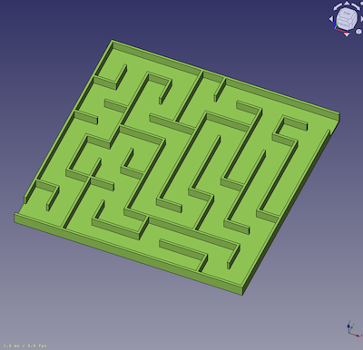
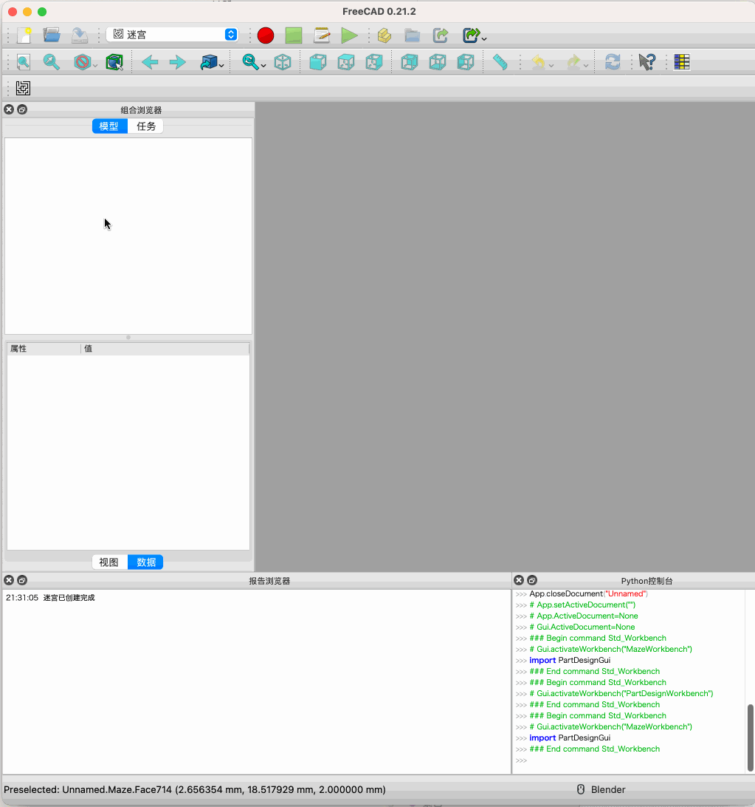

# FreeCAD 工作台（Workbench）开发笔记『三』

通过两篇内容的学习和实践，已可以创建简单的 `假迷宫` ，一个立方体；本次将通过一个算法的了解和现有的工作台功能应用，生成一个迷宫模型。

## 本节学习目标
- 了解迷宫的基本构成；
- 大致了解 `DFS` 算法，该算法可用于生成简单的迷宫；
- 了解自定义三维模型视图创建和使用；
- 完成三维迷宫创建；

## 一、迷宫

比较常见的迷宫为正方型，由一个个格子组成，一个二维的平面图，比如 10x10 的迷宫：


那些线段表示“墙”，其他空白的区域表示“路”，如果将那些连续的“墙”拆分成一段一段，如 `1cm` 为一段，那 `10cm x 10cm` 的迷宫就是有 10 个 1cm 的墙组成，如果将二维平面的迷宫转成三维，需要在长、宽的基础上增加一个高度（z轴）；

三维的迷宫从 `FreeCAD` 里生成大概可以长这样子：




## 二、DFS 算法

`DFS` 全称是 `Depth First Search`，中文名是深度优先搜索，是一种用于遍历或搜索树或图的算法，当然也适用于迷宫路径搜索。所谓深度优先，就是说每次都尝试向更深的节点走。

这里不深入展开算法本身，仅讨论算法生成的结果，如果用数组表示的话，类似于是这样：
```
[1,0,1,1,1,1]
[1,0,1,0,0,1]
[1,0,0,0,1,0]
[1,1,0,1,1,1]
[1,1,0,0,0,1]
[1,1,1,0,1,1]
```
`1` 代表墙，`0` 代表路，那在 `FreeCAD` 里只需要将 `1` 代表的墙画出来就可以了。

不过实际过程中，算法并非返回 `0` 和 `1` ，而是需要返回一个具体的两维座标。

- 具体算法本身可参考：
  - https://oi-wiki.org/graph/dfs/
  - https://www.cnblogs.com/DWVictor/p/10048554.html

## 三、画迷宫思路整理

如果算法已经返回了一个座标，那在 `FreeCAD` 里如何根据这些座标来将 `墙` 画出来？

画墙的方法还是使用 `Part` 的 `makeBox` 方法，然后将墙移动到指定座标即可。

这里的墙又分为两种：
- 从左到右，即横向的墙；
- 从下到上，即纵向的墙；

不过对于 `makeBox` 方法来说，只是 `长度` 和 `宽度` 的值不同；

所有的墙画完之后，不能直接返回给 `Shape` 对象，如果每道墙都直接返回的话，会在 `FreeCAD` 的模型树里显示一堆墙，这不是好的方式，所以还需要将这些墙进行组合，这里可以用 `Part` 的 `makeCompound` 方法将所有墙进行组合后再返回。

将上面的思路进行整理，画迷宫大致过程如下：
- 通过算法获取迷宫路径，并返回这些路径的具体座标；
- 将这些座标通过 `Part.makeBox` 方法把墙绘制出来，放到一个数组中；
- 将这个数组墙通过 `Part.makeCompound` 进行组合，返回一个复合对象；
- 最后将这个复合对象返回给 `Shape` ，在 `FreeCAD` 里显示出来，形成一个迷宫。

## 四、视图对象（ViewObject）

`ViewObject` 这被称为 `View Provider Object`，它用于定义对象在屏幕上的绘制方式，对于 `FreeCAD` 来说，`FeaturePython` 对象不仅只有属性相关定义，还需要一个视图相关定义，只是上节内容使用了默认的行为，即：
```python
maze.ViewObject.Proxy = 0
```

它也有一系列的方法，可以自定义图标，颜色等；

之所以在这里要了解 `ViewObject` ，是因为默认创建的自定义对象它的图标也是默认的，如果需要定义对象的图标，就需要用到 `ViewObject`

在这里定义一个 `ViewProviderMaze` 类，目前的作用是设置自定义对象的显示图标：
```python
class ViewProviderMaze:
    def __init__(self, obj, icon_fn=None):
        obj.Proxy = self
        self._check_attr()
        self.icon_fn = icon_fn or os.path.join(ICONPATH, "maze.svg")

    def _check_attr(self):
        if not hasattr(self, "icon_fn"):
            setattr(
                self,
                "icon_fn",
                os.path.join(ICONPATH, "maze.svg"),
            )

    def attach(self, vobj):
        self.vobj = vobj

    def getIcon(self):
        self._check_attr()
        return self.icon_fn

    def dumps(self):
        self._check_attr()
        return {"icon_fn": self.icon_fn}

    def loads(self, state):
        if state and "icon_fn" in state:
            self.icon_fn = state["icon_fn"]
```

然后在创建对象后，将 `maze.ViewObject.Proxy = 0` 改为 `ViewProviderMaze(maze.ViewObject)` 即可。 

## 五、迷宫代码实现

修改 `maze.py` ，增加几个属性：
```python
obj.addProperty("App::PropertyLength", "WallThickness", "Maze","墙厚度")
obj.addProperty("App::PropertyLength", "WallHeight","Maze", "墙高度")
obj.addProperty("App::PropertyLength", "CellSize", "Maze", "迷宫间距")

obj.addProperty("App::PropertyInteger", "Rows", "Maze", "行数量")
obj.addProperty("App::PropertyInteger", "Cells", "Maze", "列数量")

obj.addProperty("App::PropertyBool", "ShowExit", "Maze", "显示入出口")
```

`maze.py` 完整代码如下：
```python
import Part
from random import randint
from freecad import app
from freecad.maze import APPICON

class Maze:
    inited = False
    cells = 10
    rows = 10
    edgeList = []
    visited = []
    obj = None

    def __init__(self, obj):
        '''对象实始化，可以添加一些属性'''
        obj.addProperty("App::PropertyLength", "WallThickness", "Maze","墙厚度")
        obj.addProperty("App::PropertyLength", "WallHeight","Maze", "墙高度")
        obj.addProperty("App::PropertyLength", "CellSize", "Maze", "迷宫间距")

        obj.addProperty("App::PropertyInteger", "Rows", "Maze", "行数量")
        obj.addProperty("App::PropertyInteger", "Cells", "Maze", "列数量")

        obj.addProperty("App::PropertyBool", "ShowExit", "Maze", "显示入出口")

        # 保存迷宫路径，隐藏属性
        obj.addProperty("App::PropertyString", "edgeList", "Maze",
                        "edgeList", 0, False, True)

        obj.WallThickness = 2.0
        obj.WallHeight = 10.0
        obj.CellSize = 20.0
        obj.Rows = self.rows
        obj.Cells = self.cells
        obj.ShowExit = False
        obj.Proxy = self
        self.obj = obj
        self.type = 'Maze'
        self.inited = True
        self.reload(obj)

        self.make_attachable(obj)

    def make_attachable(self, obj):
        if int(app.Version()[1]) >= 19:
            obj.addExtension("Part::AttachExtensionPython")
        else:
            obj.addExtension("Part::AttachExtensionPython", obj)

        obj.setEditorMode("Placement", 0)

    def execute(self, fp):
        '''Do something when doing a recomputation, this method is mandatory'''
        if not hasattr(fp, "positionBySupport"):
            self.make_attachable(fp)

        fp.positionBySupport()
        maze_shape = self.generate_maze_shape(fp)
        if maze_shape == None:
            return

        if hasattr(fp, "BaseFeature") and fp.BaseFeature != None:
            maze_shape.Placement = (
                fp.Placement
            )
            result_shape = fp.BaseFeature.Shape.fuse(maze_shape)
            result_shape.transformShape(
                fp.Placement.inverse().toMatrix(), True
            )
            fp.Shape = result_shape
        else:
            fp.Shape = maze_shape

    def onChanged(self, fp, prop):
        '''Do something when a property has changed'''
        if str(prop) in ['Rows', 'Cells', 'ShowExit']:
            self.cells = fp.Cells if fp.Cells > 0 else self.cells
            self.rows = fp.Rows if fp.Rows > 0 else self.rows
            self.reload(fp)

        if str(prop) == 'Shape':
            self.type = 'Maze'
            self.inited = True

    def generate_maze_shape(self, fp):
        '''Do something when doing a recomputation, this method is mandatory'''
        walls = self.drawWalls(fp)
        if walls == None:
            return None
        # 将所有墙合并为一个复合形状
        maze_shape = Part.makeCompound(walls)
        return maze_shape

    def reload(self, obj):
        if self.inited == False:
            return
        
        self.edgeList = self.initEdgeList()
        self.visited = self.initVisitedList()
        self.DFS(0, 0, self.edgeList, self.visited)
        if obj.ShowExit:
            self.edgeList.remove((0, 0, 0, 1))
            self.edgeList.remove(
                (self.cells, self.rows-1, self.cells, self.rows))

        obj.edgeList = str(self.edgeList)

    def initVisitedList(self):
        visited = []
        for y in range(self.rows):
            line = []
            for x in range(self.cells):
                line.append(False)
            visited.append(line)
        return visited

    def get_edges(self, x, y):
        result = []
        result.append((x, y, x, y+1))
        result.append((x+1, y, x+1, y+1))
        result.append((x, y, x+1, y))
        result.append((x, y+1, x+1, y+1))

        return result

    def getCommonEdge(self, cell1_x, cell1_y, cell2_x, cell2_y):
        edges1 = self.get_edges(cell1_x, cell1_y)
        edges2 = set(self.get_edges(cell2_x, cell2_y))
        for edge in edges1:
            if edge in edges2:
                return edge
        return None

    def initEdgeList(self):
        edges = set()
        for x in range(self.cells):
            for y in range(self.rows):
                cellEdges = self.get_edges(x, y)
                for edge in cellEdges:
                    edges.add(edge)
        return edges

    def isValidPosition(self, x, y):
        if x < 0 or x >= self.cells:
            return False
        elif y < 0 or y >= self.rows:
            return False
        else:
            return True

    def shuffle(self, dX, dY):
        for t in range(4):
            i = randint(0, 3)
            j = randint(0, 3)
            dX[i], dX[j] = dX[j], dX[i]
            dY[i], dY[j] = dY[j], dY[i]

    def DFS(self, X, Y, edgeList, visited):
        dX = [0,  0, -1, 1]
        dY = [-1, 1, 0,  0]
        self.shuffle(dX, dY)
        for i in range(len(dX)):
            nextX = X + dX[i]
            nextY = Y + dY[i]
            if self.isValidPosition(nextX, nextY):
                if not visited[nextY][nextX]:
                    visited[nextY][nextX] = True
                    commonEdge = self.getCommonEdge(X, Y, nextX, nextY)
                    if commonEdge in edgeList:
                        edgeList.remove(commonEdge)
                    self.DFS(nextX, nextY, edgeList, visited)

    def drawWalls(self, fp):
        walls = []

        cellSize = fp.CellSize
        wallHeight = fp.WallHeight
        wallThickness = fp.WallThickness

        edgeList = self.edgeList if self.edgeList != [] else eval(fp.edgeList)

        if cellSize <= 0 or wallHeight <= 0 or wallThickness <= 0 or edgeList == []:
            return None

        for edge in edgeList:
            # 位置信息
            vector = app.Vector(edge[0]*cellSize, edge[1]*cellSize, 0)
            # 竖线
            if edge[0] == edge[2]:
                # 创建墙的几何形状
                wall = Part.makeBox(wallThickness, cellSize +
                                    wallThickness, wallHeight)
            else:
                wall = Part.makeBox(cellSize+wallThickness,
                                    wallThickness, wallHeight)

            # 将墙移动到指定的位置
            wall.translate(vector)
            walls.append(wall)
        # 添加地面
        ground = Part.makeBox(self.cells*cellSize+wallThickness,
                              self.rows*cellSize+wallThickness, wallThickness)
        walls.append(ground)
        return walls
    
    def loads(self, state):
        pass

    def dumps(self):
        pass


class ViewProviderMaze:
    def __init__(self, obj, icon_fn=None):
        obj.Proxy = self
        self._check_attr()
        self.icon_fn = icon_fn or APPICON

    def _check_attr(self):
        if not hasattr(self, "icon_fn"):
            setattr(
                self,
                "icon_fn",
                APPICON,
            )

    def attach(self, vobj):
        self.vobj = vobj

    def getIcon(self):
        self._check_attr()
        return self.icon_fn

    def dumps(self):
        self._check_attr()
        return {"icon_fn": self.icon_fn}

    def loads(self, state):
        if state and "icon_fn" in state:
            self.icon_fn = state["icon_fn"]
```

然后将 `init_gui.py` 的以下代码：
```python
    def Activated(self):
        from .maze import Maze
        maze = app.ActiveDocument.addObject("Part::FeaturePython", "Maze")
        Maze(maze)
        maze.ViewObject.Proxy = 0
        app.ActiveDocument.recompute()

        app.Console.PrintMessage("迷宫已创建完成\n")
        return
```
修改为：
```python
    def Activated(self):
        from .maze import Maze, ViewProviderMaze
        maze = app.ActiveDocument.addObject("Part::FeaturePython", "Maze")
        Maze(maze)
        ViewProviderMaze(maze.ViewObject)
        app.ActiveDocument.recompute()
        gui.SendMsgToActiveView("ViewFit")

        app.Console.PrintMessage("迷宫已创建完成\n")
        return
```

将原来 `init_gui.py` 以下代码移到 `__init__.py`
```python
import os

ROOTPATH = os.path.join(os.path.dirname(__file__))
ICONPATH = os.path.join(ROOTPATH, "resources/icons")
APPICON = os.path.join(ICONPATH, "maze.svg")
```

并增加 `from freecad.maze import APPICON` 从 `__init__.py` 模块引用 `APPICON`

完成后重新打开 `FreeCAD` ，如果一切正常，将可以看到 `迷宫` 工作台，创建一个新的文档，并点击 `创建迷宫` 按钮，即可生成一个三维迷宫：



## 小结

本节主要是简单的介绍了一下 `DFS` 算法，分析了三维迷宫构成，以及生成的过程，同时学习了 `ViewObject` 的作用，最后使用用代码实现了完整的三维迷宫的创建。

至此 `FreeCAD` 一个工作台的开发基本完成，从基本概念到目录结构，再到最终自定义三维对象的创建，学习了工作台开发的所有基本步骤，学习目标完成，但并未对代码进行优化。

本系列开发笔记完结。

完整代码参考：https://github.com/ronggang/study-freecad

## 参考资料
- Python 使用 `DFS` 算法生成迷宫 https://github.com/tpof314/maze